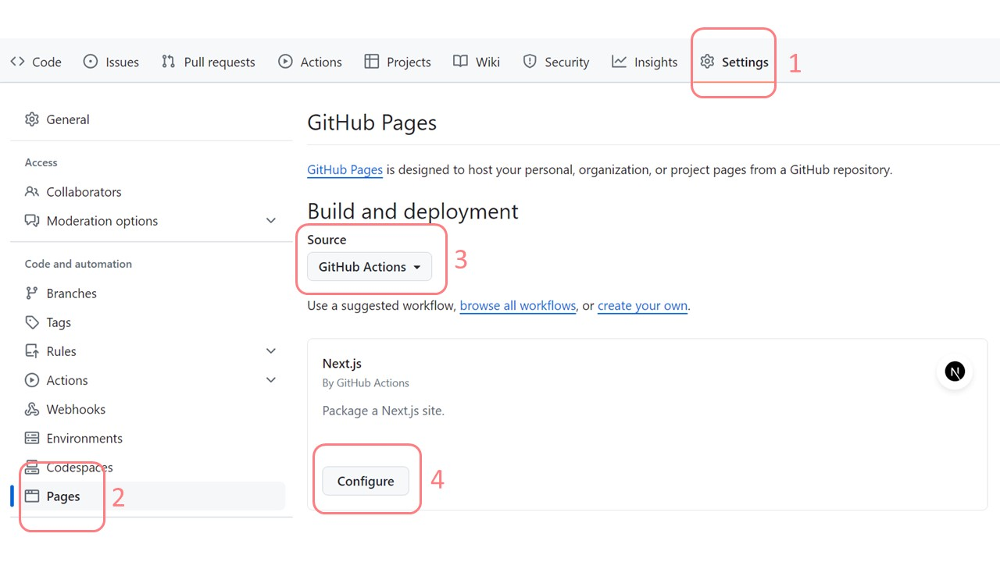
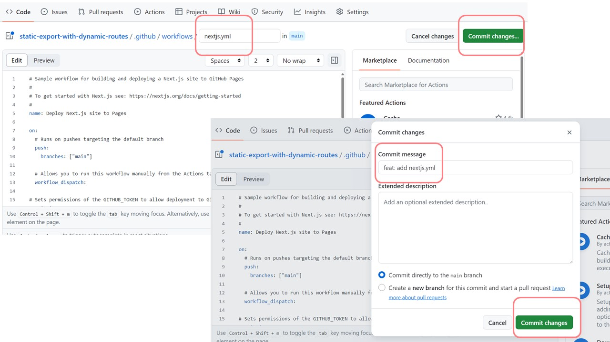
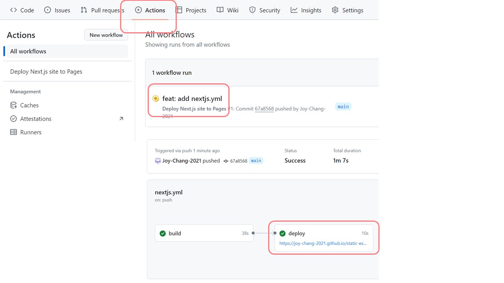

# Next.js static export

### [Github Page Demo](https://joy-chang-2021.github.io/next.js_static_export/)

- 輸出靜態網頁、部署於 github-page
  1. [Static Exports](https://nextjs.org/docs/app/building-your-application/deploying/static-exports) | NEXT.js
  2. [Deploy a Next.js App to GitHub Pages](https://youtu.be/mJuz45RXeXY) | NL Tech on Youtube
  3. [How to Deploy Next.js Apps to Github Pages](https://www.freecodecamp.org/news/how-to-deploy-next-js-app-to-github-pages/) | freeCodeCamp
  4. [Next.js Deploy as a Static Site using Github Pages](https://dev.to/lico/nextjs-deploy-as-static-site-using-github-pages-3bhm) | SeongKuk Han from Dev.to

---
- 動態路由、靜態打包設定 [參考↗](https://github.com/Joy-Chang-2021/next.js_static_export_with_dynamic_routes)

### next.config.js

1. `output` 設定專案為靜態打包輸出
2. `basePath`  
    專案資源 Next.js 原本預設路徑是 `https://<username>.github.io/`  
    使用 basePath 將路徑設為 `https://<username>.github.io/<project-name>/`  
3. `assetPrefix` 
    - 將靜態資源託管於 CDN 服務、減少專案伺服器載入的資源流量 [doc ↗](https://nextjs.org/docs/app/api-reference/next-config-js/assetPrefix)
    - 設定 assetPrefix 為 CDN 的前綴路徑  
        Next.js 會自動將 `/_next/` 路徑內載入的靜態資源加上 asset prefix  
        → 此專案並未將資源部署在 CDN 服務上，故未使用此設定

    ```javascript
    const nextConfig = {
        output: "export",
        basePath: "/專案名稱",
    }

    export default nextConfig
    ```

### images
- 原絕對路徑 `<Image src="/vercel.svg" />` 改為相對路徑 `<Image src="vercel.svg" />`

### github actions

1. Settings > Pages > Github Actions > Configure 依序點選設定  
    - github 根據專案內框架提供相應的自動化流程設定選擇

    

2. github 設定自動化工作流程
    - yml 檔案名稱可以隨意修改
    - 視需求調整設定內容

    

3. 每次推送/合併於 main 分支時，會自動部署更新 github-pages
    - 可於 Actions 查看部署過程

    

---

### Additional Notes
- 有些文章建議於根目錄新增 `.nojekyll` 檔案
    1. [about-github-pages](https://docs.github.com/en/pages/getting-started-with-github-pages/about-github-pages) | GitHub Docs
    2. [bypassing-jekyll-on-github-pages](https://github.blog/news-insights/the-library/bypassing-jekyll-on-github-pages/) | GitHub Blog
    - GitHub Pages 目前由 GitHub Actions 來執行 Jekyll 打包輸出  
    因 Jekyll 將 `_` 開頭的檔案及資料夾視為特殊資源、不會進行打包處理
    - 如果無法使用 GitHub Actions，將 `.nojekyll` 建立於專案根目錄中，繞過 Jekyll 打包流程、直接部署專案內容
